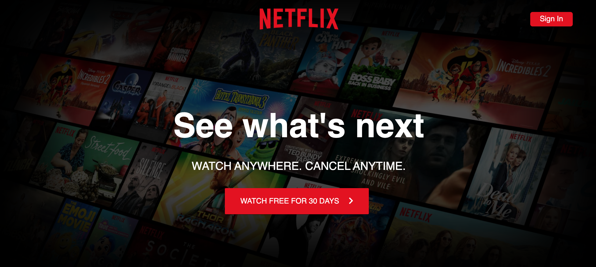
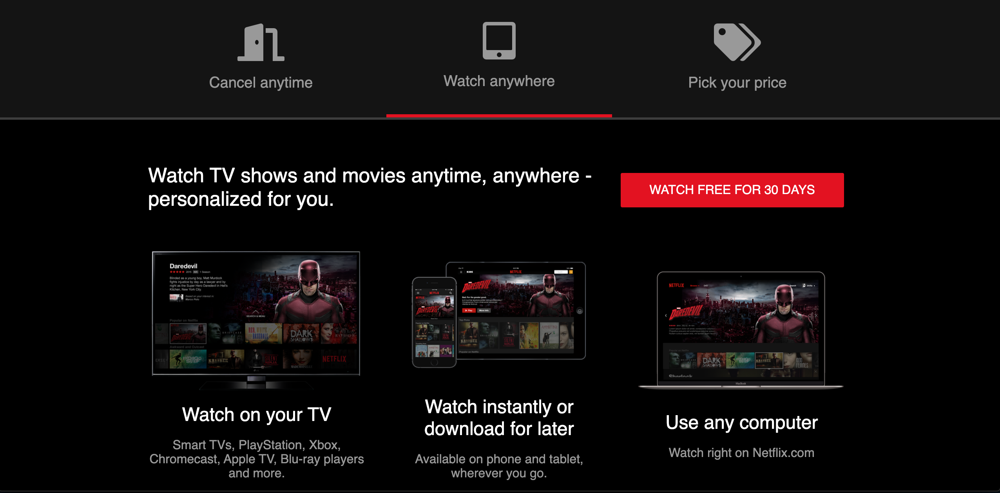
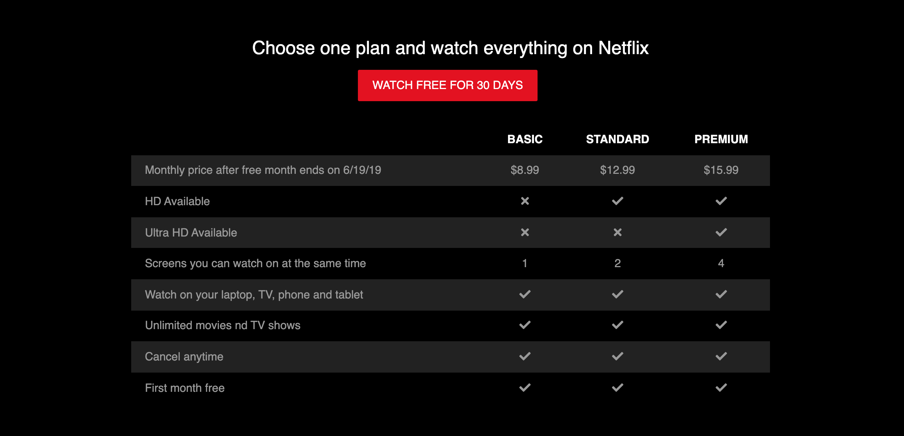

# NetflixClone

## Description

This website is a simple clone of an old Netflix Landing Page. The user is able to toggle between tabs to see information about choosing a plan, watching on multiple devices and cancelling one's subscription. The site is also fully responsive across multiple devices.

## Table of Contents

-   [Project Summary](#description)
-   [Preview](#preview)
-   [Deployed App](#app)
-   [Contact Me](#questions)

## Preview

Below are some example images of the site!

## App

Here is a link to the deployed website on GitHub Pages:
[Netflix Clone](https://habby-bit.github.io/NetflixClone/)

## Questions?

If you have any questions, please don't hesitate to reach out!

Github: [habby-bit](https://github.com/habby-bit)

Email: [habbyolu@gmail.com](habbyolu@gmail.com)
